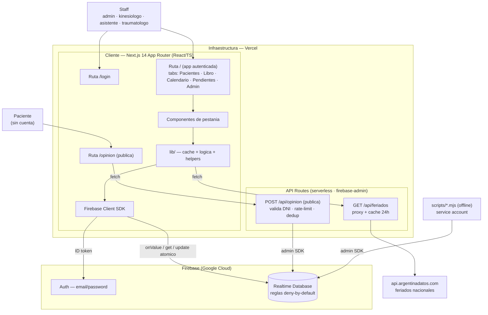
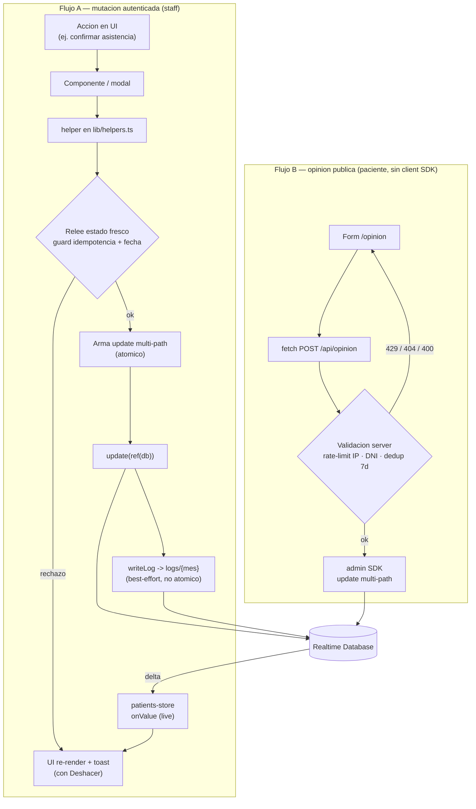
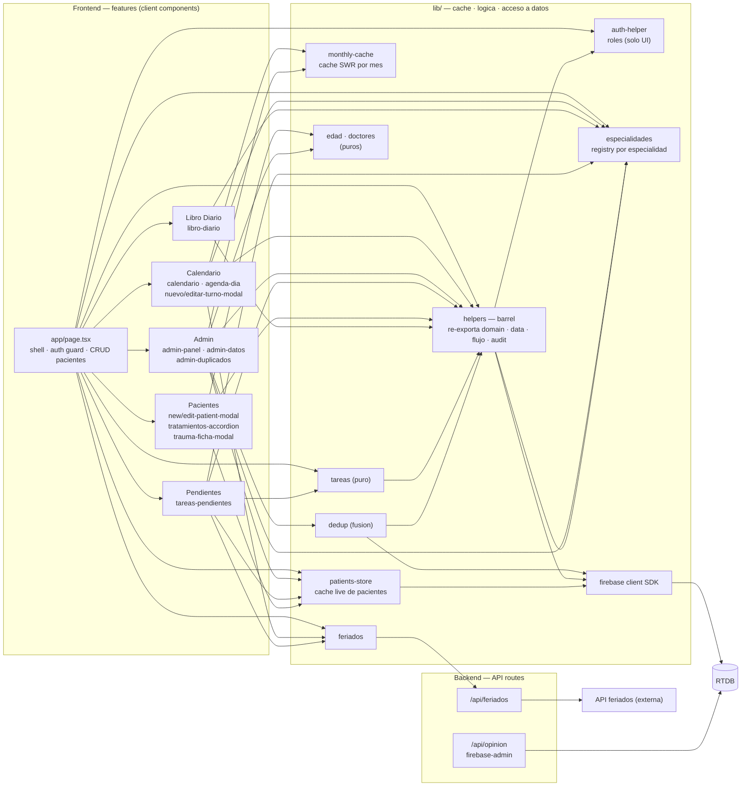

# Arquitectura — crudkinesiologia

Sistema de gestión del consultorio **Kinesiología Integral**. Desde jul 2026 es
**multi-especialidad**: kinesiología + traumatología sobre un modelo de **paciente
compartido** (una ficha por persona; la especialidad taggea la actividad). Tercera
especialidad planificada: medicina clínica (ver `lib/especialidades.ts`).

**Stack:** Next.js 14 (App Router) · React 18 · TypeScript · Tailwind · ShadCN/Radix ·
Firebase Realtime Database (client SDK) + Firebase Auth · `firebase-admin` (server) ·
desplegado en **Vercel**.

> Documentación viva: los diagramas son **Mermaid** para que rendericen en GitHub y se
> mantengan junto al código. Tres niveles de abstracción, sin mezclarlos:
> **(1) System Architecture**, **(2) Data Flow**, **(3) Component Diagram**.

---

## 1. System Architecture (alto nivel)

**Decisiones que muestra el diagrama**

- **No hay backend propio para los datos.** El staff autenticado escribe/lee **directo
  contra RTDB** con el client SDK; la seguridad la dan las **reglas de RTDB**
  (`deny-by-default`), no una capa de API. Esto abarata y simplifica, pero concentra
  toda la garantía de seguridad en las reglas (ver Observaciones).
- **Las API routes existen solo para lo que el cliente no puede/no debe hacer:** el
  formulario **público** de opinión (el paciente no tiene cuenta → toda la validación es
  server-side con admin SDK) y un **proxy de feriados** (cachea 24 h y oculta el origen).
- **Auth es un servicio aparte:** el client SDK obtiene un ID token de Firebase Auth y con
  él autentica cada llamada a RTDB. Los **roles** (`auth-helper`) son **solo de UI**.
- **Contexto de especialidad en el cliente.** El rol fija la especialidad activa (el
  traumatólogo trabaja fijo en la suya; el admin alterna con un selector). Agenda, Datos y
  Recepción filtran **en memoria** por el tag `especialidad` de turnos/entradas (ausente =
  kinesiología, retrocompat con todo el histórico). La lectura de RTDB sigue siendo **una y
  compartida** — nunca un fetch por especialidad.
- **Mantenimiento offline** (auditoría de DNIs, rotación de contraseñas) corre por fuera de
  la app, con service account.

---

## 2. Data Flow Diagram

Desde la acción del usuario hasta la persistencia. Se muestran los **dos** caminos de
escritura (mismo nivel de abstracción): el autenticado (staff, vía client SDK) y el
público (paciente, vía API route).

**Decisiones que muestra el diagrama**

- **Escrituras multi-path atómicas.** Las mutaciones que tocan varios nodos (confirmar
  asistencia toca `pacientes` + `turnos` + `libroDiario`; eliminar paciente toca
  `pacientes` + sus `turnos`; fusionar duplicados) se hacen en **un solo
  `update(ref(db), {...})`** → o se aplica todo o nada. Las reversibles devuelven un
  payload `revert` para el **"Deshacer"** del toast.
- **Idempotencia por relectura.** Antes de mutar, el helper relee el estado fresco de RTDB
  (no confía en el prop del modal, que puede estar viejo) para no duplicar sesiones ni
  descontar de más si otro usuario ya actuó.
- **Propagación reactiva sin invalidación manual.** El que escribe no refresca a mano:
  `patients-store` está suscripto `onValue`, así que el delta vuelve solo y la UI
  re-renderiza (incluso ante cambios de otros usuarios).
- **El camino público nunca toca el client SDK.** La validación (rate-limit por IP
  hasheada, existencia del DNI, 1 opinión por paciente cada 7 días) es 100% server-side.

---

## 3. Component Diagram

Módulos internos de frontend y backend, sus responsabilidades y dependencias. Las
primitivas de UI (`components/ui/*`, ShadCN/Radix) se omiten: son hojas que todos
consumen y no aportan al grafo de dependencias de negocio.

**Decisiones / lecturas que muestra el diagrama**

- **`helpers` y `patients-store` son los dos hubs.** Casi todas las features dependen de
  `helpers` (acceso a datos + lógica de negocio + auditoría) y de `patients-store` (la
  colección de pacientes). Es el acoplamiento central del sistema (ver Observaciones).
- **Separación caché / lógica / cómputo puro.** `patients-store` y `monthly-cache`
  resuelven el costo de datos; `helpers`/`dedup` encapsulan las escrituras; `tareas` es
  **puro** (deriva la pestaña Pendientes desde lo ya cacheado, sin lecturas nuevas).
- **Admin compone, no reimplementa.** `admin-panel` orquesta cuatro vistas
  (Registro · Opiniones · Datos · Duplicados) reutilizando las mismas cachés y helpers que
  el resto de la app (misma key de mes → caché compartida).
- **El único puente al backend desde lib es `feriados -> /api/feriados`.** Todo lo demás
  del cliente va directo al SDK.
- **`especialidades` es el registry transversal.** Todas las pestañas y `helpers` derivan
  de él labels, filtros y comportamiento clínico por especialidad — nada de
  `=== "traumatologia"` suelto. Sumar una especialidad = una entrada acá (+ checklist del
  propio archivo). `edad` y `doctores` son módulos **puros** chicos (derivar edad de
  `fechaNacimiento`; dedup de derivantes).

---

## Estructura de datos (RTDB)

| Nodo | Contenido | Reglas |
|---|---|---|
| `pacientes/{id}` | ficha del paciente (clave `push()` ≈ fecha de alta) · sub-nodo `traumatologia/consultas[]` = historial de la 2ª especialidad | `auth != null` (R/W) |
| `turnos/{yyyy-MM-dd}/{turnoId}` | turnos por fecha · campo `especialidad?` (ausente = kinesiología) | `auth != null` (R/W) |
| `libroDiario/{yyyy-MM-dd}/entradas/{entryId}` | entradas del libro (mapa por id) · `especialidad?` taggea los cobros de trauma para el split de Datos | `auth != null` (R/W) |
| `logs/{yyyy-MM}/{logId}` | registro de actividad | lectura: 5 emails admin · escritura: `!data.exists()` (append-only) |
| `opiniones/{yyyy-MM}/{id}` | opiniones por QR | lectura: 5 emails admin · escritura: **solo admin SDK** |
| `opinionesIndice/{patientId}` · `opinionThrottle/{ipHash}` | anti-abuso del QR | **solo admin SDK** (clientes denegados por default) |
| `config/*` | tarifas por cobertura | **planificado, aún no implementado** (no está en las reglas ni en el código) |

---

## Decisiones de arquitectura

### Caché / costo de datos (RTDB factura por GB descargado)
- **`pacientes`** → una sola suscripción **live** (`onValue`) compartida vía `usePatients()`;
  búsqueda, orden y paginación se resuelven **en memoria** (`queryPatients`). Primera carga
  baja todo; después solo deltas.
- **Datos por mes** (logs, opiniones, métricas de Datos) → **caché de sesión** con
  `useCachedMonth()`. Los meses pasados son inmutables (no se revalidan); el actual revalida
  en background (SWR).
- **Calendario** → caché por mes (`turnos-cal/{mes}`) con `clearCachePrefix` al mutar.
- **Feriados** → caché por año compartida (`lib/feriados.ts`), sobre `/api/feriados` (que a
  su vez cachea 24 h en el server).
- **Excepción deliberada:** el **libro diario NO se cachea** en lectura — es dato financiero,
  se escribe desde dos lados sin señal confiable de invalidación cross-tab.

### Multi-especialidad (paciente compartido — jul 2026)
- **Una sola ficha por persona; la especialidad es un tag de actividad**, no colecciones
  separadas: `turnos/*/especialidad?`, `libroDiario/*/entradas/*/especialidad?` y el
  sub-nodo `pacientes/{id}/traumatologia` (historial de consultas propio). Tag **ausente =
  kinesiología** → todo el histórico pre-especialidades sigue válido sin migración.
- **`lib/especialidades.ts` es el registry único**: labels, badge del libro, qué ficha abre
  la grilla y los **flags de comportamiento clínico**. `registraSesionKine` decide qué hace
  confirmar asistencia: en kine registra sesión en tratamientos + fila en $0 del libro; en
  trauma solo marca el estado (factura por consulta: monto opcional → entrada taggeada en el
  libro, escrita en el **mismo update multi-path** que la consulta). El propio archivo trae
  el checklist para sumar la 3ª especialidad (medicina clínica).
- **Filtrado en memoria sobre la lectura compartida** (`filtrarTurnosPorEspecialidad`,
  `LibroResumen.porEspecialidad`): jamás un fetch por especialidad (costo de datos).
- **Rol → especialidad en `auth-helper`** (el traumatólogo trabaja fijo; el admin alterna).
  Como el resto de los roles, es **solo UI** hasta endurecer reglas (obs #9 / F6).
- **La ficha se ve completa desde cualquier rol**: el traumatólogo ve la historia de kine
  read-only en su modal; kine ve el historial de trauma read-only en el suyo.

### Seguridad
- Reglas RTDB **deny-by-default**; los datos solo con `auth != null`.
- Lo **público** (`/opinion`) **nunca toca el client SDK** → pasa por una **API route con
  admin SDK** que valida DNI contra `pacientes`, aplica **rate-limit por IP hasheada** y
  dedup (1 opinión por paciente cada 7 días).
- `logs` y `opiniones`: lectura solo para los 5 emails admin; `logs` **append-only**;
  `opiniones`/`opinionesIndice`/`opinionThrottle` solo escribibles por el admin SDK.
- Roles (`ROLE_MAP` en `auth-helper.ts`) son **solo UI** por ahora — las reglas aún no
  filtran por rol ni validan la forma de los datos (ver Observaciones).
- **No hay `middleware.ts`:** el gateo de `/login` es client-side (`onAuthStateChanged`); el
  shell se sirve a cualquiera, pero sin sesión RTDB no entrega datos.
- Credenciales del service account en variables de entorno (`FIREBASE_*`), validadas en build
  por `vercel-build.js`.

### Auditoría / integridad
- **Toda mutación de negocio pasa por `writeLog`** → `logs/{mes}` (lo muestra la pestaña
  Registro). Es **best-effort**: corre como escritura aparte después de la mutación y traga
  errores para no romper el flujo (ver Observaciones).
- Escrituras multi-path **atómicas** para lo que toca varios paths; las reversibles devuelven
  `revert` para el **"Deshacer"**.
- Identidad estable (claves `push()` / `crypto.randomUUID()`), no índices de array.
- Fechas en **timezone Argentina** (`date-fns-tz`) para las claves `{yyyy-MM-dd}` y los
  buckets `{yyyy-MM}`.

---

## Architecture Observations

Hallazgos verificados contra el código (no asumidos). Ordenados por impacto aproximado.

> **Actualización (jul 2026).** La **multi-especialidad (F1–F4) está en producción**:
> registry `lib/especialidades.ts`, ficha de trauma con historial de consultas + facturación
> directa al libro, Datos/Libro con split por especialidad, Recepción filtrada. Módulos
> nuevos: `especialidades` (registry), `trauma-ficha-modal`, `scroll-fab` (FAB de scroll
> compartido), página `app/dev-agenda` (test de layout local, 404 en producción). Hardening
> mobile: la agenda ya no desborda en pantallas angostas (cadena `min-w-0`; la causa era el
> `truncate` de las notas propagando su min-content) y el header envuelve. Flujo de trabajo:
> rama **`dev`** (preview de Vercel contra la MISMA base de producción) → ff-merge a `main`.
> Efectos sobre las observaciones: **#5 y #6 resueltas en lo estructural (refactor R1/R2)**:
> `helpers.ts` es ahora un **barrel de re-exports** y el contenido vive partido por
> responsabilidad en `lib/domain/*` (deserialización PURA con **tests de retrocompat** —
> `npm test`, Vitest, primera suite del repo), `lib/data/*` (acceso a RTDB),
> `lib/flujo/asistencia` (lógica clínica con escrituras) y `lib/audit/log`. Pendientes: R3
> (migrar imports directos y borrar el barrel) y R4 (los componentes grandes de la obs #7,
> por oportunidad). **#9 tiene plan concreto (fase F6)**: custom claims +
> reglas por rol + auditoría de write-paths — con una restricción nueva a respetar: los
> updates multi-path deben pasar TODAS las reglas juntas (confirmar asistencia de kine
> escribe `libroDiario` aunque el rol no vea esa pestaña; trauma escribe consulta + cobro en
> un solo update). Volumen real ahora conocido: **~2.600 pacientes** → la obs #1 hoy está
> holgada.

> **Actualización (jun 2026).** Cambios materiales desde esta revisión: **obs #8 resuelta**
> (código muerto de auth borrado). Nuevos módulos puros: `lib/edad.ts` (la edad se deriva de un
> nuevo campo `fechaNacimiento`; la `edad` guardada queda como snapshot legacy) y `lib/doctores.ts`
> (dedup/canonicalización de médicos derivantes). Se centralizó `esParticular` (vacío / `-` /
> `particular`) como criterio único de "cobertura particular", usado en el libro y en Datos. La
> pestaña **"Pendientes" pasó a llamarse "Recepción"** (solo la etiqueta; el key interno
> `pendientes` y `?tab=pendientes` no cambian). Se removió la cadena de toast de Radix sin usar (la
> app usa `sonner`). Los cuellos de botella #1–#7 y #9 siguen vigentes.

### Cuellos de botella
1. **`usePatients()` baja y mantiene en memoria la colección `pacientes` entera.** Filtrado,
   orden y paginación son en memoria. Es la decisión correcta para el costo de datos de **un**
   consultorio (una sync + deltas), pero el primer load y la memoria crecen **linealmente**
   con la cantidad de pacientes y no hay paginación a nivel DB. Techo práctico: cientos / pocos
   miles de fichas; no escala más allá. *(No pude verificar el volumen real de pacientes → no
   puedo cuantificar a partir de qué número empieza a doler.)*
2. **`writeLog` no es atómico con la mutación que audita.** Se ejecuta como un `push` separado
   *después* del `update`, y **traga sus propios errores**. Una mutación puede persistir y su
   log fallar → huecos en una bitácora que se presenta como "append-only". Además, al loguearse
   en el cliente, la auditoría vale lo que valga el cliente: un usuario autenticado podría
   escribir vía SDK crudo sin loguear.

### Acoplamientos innecesarios / frágiles
3. **Invalidación de caché por props "trigger" numéricos.** `app/page.tsx` propaga
   `libroDiarioUpdateTrigger`, `calendarioRefreshTrigger` y nonces para forzar refetches. Es un
   canal de invalidación manual y frágil (fácil olvidar incrementarlo). El modelo `live` de
   `patients-store` es la mejor referencia: mover turnos/libro a una caché reactiva similar
   eliminaría estos triggers.
4. **Caché de turnos no se invalida cross-user.** `turnos-cal/{mes}` solo se limpia con
   `clearCachePrefix` ante una mutación **local**; el turno que crea **otro** usuario/pestaña no
   invalida tu caché de calendario (a diferencia de `pacientes`, que es live). Riesgo menor de
   datos algo viejos en el calendario entre usuarios.
5. **Normalización de datos legacy dispersa.** El parseo defensivo de `sesiones`
   (string | array | objeto), `tratamientos` y `dni`-como-número está repetido en `normalize`
   (store), `parseTratamientosRaw`, `normalizeLibroEntradas` y dentro de `confirmarAsistencia`.
   Centralizar la (de)serialización de paciente/turno reduciría duplicación.

### Módulos demasiado grandes
6. **`lib/helpers.ts` (≈623 líneas) es un god-module.** Mezcla acceso a datos
   (`fetchTurnosPorRango`, `fetchLibroDiarioPorRango`, `fetchOpinionesMes`, `fetchLogsMes`),
   lógica de dominio compleja (`confirmarAsistencia`, `reconciliarAusencia`), auditoría
   (`writeLog`) y **tipos** (`LibroDiarioEntry`, `Opinion`, `LogEntry`, `LogAccion`). Es el de
   mayor fan-in del repo. Sugerencia: partir en `data/turnos.ts`, `data/libro.ts`,
   `data/opiniones-logs.ts`, `domain/asistencia.ts`, `audit/log.ts`.
7. **Componentes de 700–940 líneas** que mezclan fetch + reglas de negocio + JSX (variantes
   mobile y desktop inline): `libro-diario` (937), `admin-datos` (898), `nuevo-turno-modal`
   (803), `edit-patient-modal` (789), `editar-turno-modal` (698). Oportunidad: extraer
   subcomponentes presentacionales y hooks (`useLibroDiario`, `useTurnoForm`).

### Seguridad / código muerto
8. **✅ Resuelto (jun 2026) — código muerto de "auth verification".** Se borró `getAuthHeaders()`
   (`auth-helper.ts`) y `adminAuth` (`firebase-admin.ts`), y se corrigió el skill `kine-dev` que
   describía un control inexistente. Las dos API routes siguen siendo **públicas** y **no hay**
   verificación de ID token server-side — pero ahora **ningún código finge tenerla**. Si a futuro
   se agrega un endpoint autenticado que use identidad de usuario, implementar `verifyIdToken`
   (admin SDK) ahí.
9. **La seguridad de escritura depende 100% de reglas RTDB groseras.** Para
   `pacientes`/`turnos`/`libroDiario` la regla es solo `auth != null`: **cualquier** usuario
   autenticado (cualquier rol) puede escribir **cualquier forma** en esos nodos — sin validación
   de campos, sin esquema, sin enforcement de rol. Los roles son solo UI. Endurecer **antes** de
   abrir cuentas a pacientes o sumar usuarios menos confiables (validación de forma en reglas, o
   mover mutaciones sensibles a API routes con admin SDK + auditoría server-side y atómica).

### Mejoras recomendadas (resumen accionable)
- Hacer el log **atómico** con la mutación (incluirlo en el `update` multi-path) y/o moverlo a
  server-side para una auditoría confiable. *(Resuelve #2 y parte de #9.)*
- Reemplazar los props-trigger por cachés reactivas estilo `patients-store` para turnos y libro.
  *(Resuelve #3 y #4.)*
- Partir `helpers.ts` y los componentes grandes; extraer un módulo de (de)serialización de
  dominio. *(Resuelve #5, #6, #7.)*
- ✅ **Hecho:** borrados `getAuthHeaders`/`adminAuth` y corregido el skill. *(Resuelve #8.)* La
  verificación server-side solo hace falta si se agrega un endpoint autenticado.
- Endurecer reglas RTDB (validación de forma + rol) en el roadmap de seguridad. *(Resuelve #9.)*

---

## Información faltante / no verificada

Para no asumir, se deja explícito lo que **no** pude confirmar leyendo el repo:

- **Tests / CI:** desde jul 2026 hay **tests unitarios** (`npm test`, Vitest) para los módulos
  puros de `lib/domain/*` — documentan el contrato de retrocompat de los datos legacy. No hay
  CI todavía (se corren a mano junto con `tsc`; `npm run lint` sigue sin usarse).
- **Contenido de variables de entorno:** solo se conocen los **nombres** (`NEXT_PUBLIC_FIREBASE_*`
  para el cliente, `FIREBASE_*` para el admin), no sus valores ni el entorno real.
- **Volumen de datos:** ~2.600 pacientes (visto en la UI, jul 2026) → el store in-memory
  (obs. #1) hoy trabaja holgado; re-evaluar si el padrón se multiplica.
- **Firebase Storage:** `next.config.js` whitelist-ea `firebasestorage.googleapis.com` para
  imágenes, pero **no se halló uso de Storage** en el código (posible config vestigial).
- **Scripts offline:** se confirmó la existencia de `scripts/dni-audit.mjs` y
  `scripts/rotate-passwords.mjs`, pero no se auditó su contenido en detalle.
