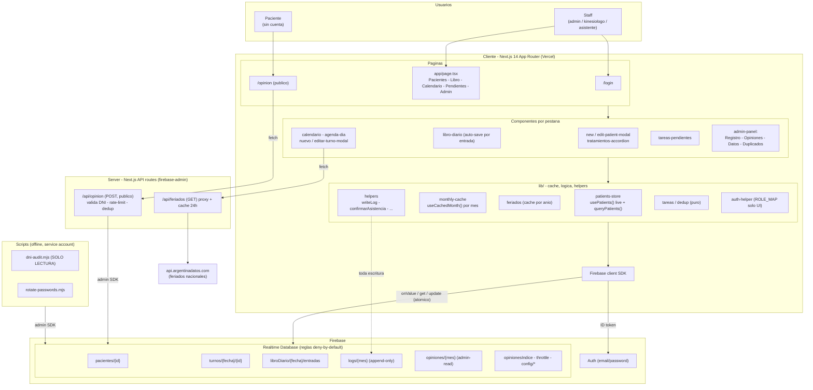

# Arquitectura — crudkinesiologia

Sistema de gestión de consultorio kinesiológico (Kinesiología Integral).

**Stack:** Next.js 14 (App Router) · React · TypeScript · Tailwind · ShadCN/Radix ·
Firebase Realtime Database (client SDK) + Firebase Auth · firebase-admin (server) ·
desplegado en Vercel.

---

## Diagrama (Mermaid)



---

## Diagrama (ASCII, para terminal)

```
╔══════════════════════════════════════════════════════════════════════════════╗
║                                   USUARIOS                                       ║
║   Staff (admin / kinesiólogo / asistente)              Paciente (sin cuenta)     ║
╚════════════════════╤══════════════════════════════════════════╤════════════════╝
           login email+pass │                                    │ /opinion (público)
                            ▼                                    ▼
┌──────────────────────────────────────────────────────────────────────────────┐
│                       CLIENTE — Next.js 14 (App Router) · Vercel               │
│                       React · TypeScript · Tailwind · ShadCN/Radix             │
│                                                                                │
│  app/login         app/page.tsx  (app autenticada, onAuthStateChanged)         │
│  app/opinion       └── nav: Pacientes │ Libro │ Calendario │ Pendientes │ Admin │
│                                                                                │
│  ┌───────── COMPONENTES (por pestaña) ──────────────────────────────────────┐ │
│  │ Pacientes  → new/edit-patient-modal, tratamientos-accordion, delete-dialog│ │
│  │ Libro Diario → libro-diario (auto-save por entrada, PDF)                   │ │
│  │ Calendario → agenda-dia, nuevo-turno-modal, editar-turno-modal            │ │
│  │ Pendientes → tareas-pendientes (tareas derivadas, CTAs a los modales)     │ │
│  │ Admin      → admin-panel ▸ Registro · Opiniones · Datos · Duplicados       │ │
│  └───────────────────────────────────────────────────────────────────────────┘ │
│                                   │ usan                                        │
│  ┌───────── lib/ : CACHÉ + LÓGICA + HELPERS ────────────────────────────────┐ │
│  │ patients-store   usePatients() — UNA suscripción live (onValue) a         │ │
│  │                  pacientes + queryPatients() (filtra/ordena en memoria)   │ │
│  │ monthly-cache    useCachedMonth() — caché de sesión por mes               │ │
│  │ feriados         fetchFeriados() — caché por año (compartida)             │ │
│  │ helpers          fetchTurnosPorRango, confirmarAsistencia, addToLibro,    │ │
│  │                  writeLog, getSessionStats … (TODA escritura → writeLog)  │ │
│  │ tareas / dedup   cómputo PURO de Pendientes / fusión de duplicados        │ │
│  │ auth-helper      ROLE_MAP (solo UI), getAuthHeaders                       │ │
│  └───────────────────────────────────────────────────────────────────────────┘ │
│         │ Firebase client SDK (firebase.ts)                                     │
└─────────┼───────────────────────────────────┬──────────────────────────────────┘
          │ onValue / get / update (atómico)  │ fetch (con ID token / público)
          ▼                                    ▼
┌───────────────────────────────────┐   ┌──────────────────────────────────────┐
│        FIREBASE                    │   │   SERVER — Next.js API routes         │
│  Auth (email/password)            │   │   (firebase-admin SDK · server-only)  │
│                                    │   │                                       │
│  Realtime Database  ── reglas ──┐ │◀──┤  /api/opinion  POST  (PÚBLICO)        │
│   pacientes/{id}                │ │   │   valida DNI · rate-limit IP · dedup  │
│   turnos/{fecha}/{id}           │ │   │                                       │
│   libroDiario/{fecha}/entradas  │ │   │  /api/feriados GET → proxy +caché24h  │
│   logs/{mes}      (append-only) │ │   └───────────────────┬──────────────────┘
│   opiniones/{mes} (admin-read)  │ │                       │ fetch
│   opinionesIndice · throttle    │ │                       ▼
│   config/* (tarifas — futuro)   │ │          ┌─────────────────────────────┐
│                                 │ │          │ api.argentinadatos.com       │
│  Reglas: deny-by-default;       │ │          │ (feriados nacionales)        │
│  datos solo auth!=null;         │ │          └─────────────────────────────┘
│  logs/opiniones solo 5 admins   │ │
└────────────────┬────────────────┘ │
                 ▲ node + service account (.env.local)
       ┌─────────┴──────────────────────────────┐
       │  SCRIPTS (offline, manuales)            │
       │   scripts/dni-audit.mjs   (SOLO LECTURA)│
       │   scripts/rotate-passwords.mjs          │
       └─────────────────────────────────────────┘
```

---

## Decisiones de arquitectura

### Caché / costo de datos (RTDB factura por GB descargado)
- **`pacientes`** → una sola suscripción **live** (`onValue`) compartida vía
  `usePatients()`; búsqueda, orden y paginación se resuelven **en memoria**
  (`queryPatients`). Primera carga baja todo; después solo deltas.
- **Datos por mes** (logs, opiniones, métricas de Datos) → **caché de sesión**
  con `useCachedMonth()`. Los meses pasados son inmutables (no se revalidan).
- **Calendario** → caché por mes (`turnos-cal/{mes}`) con `clearCachePrefix` al mutar.
- **Feriados** → caché por año compartida (`lib/feriados.ts`), sobre `/api/feriados`
  (que a su vez cachea 24 h en el server).
- **Excepción deliberada:** el **libro diario NO se cachea** en lectura — es dato
  financiero, se escribe desde dos lados (auto-save + confirmar asistencia) sin
  señal confiable de invalidación cross-tab.

### Seguridad
- Reglas RTDB **deny-by-default**; los datos solo con `auth != null`.
- Lo **público** (`/opinion`) **nunca toca el client SDK** → pasa por una **API
  route con admin SDK** que valida (DNI contra pacientes), aplica **rate-limit por
  IP hasheada** y dedup (1 opinión por paciente cada 7 días).
- `logs` y `opiniones`: lectura solo para los 5 emails admin; `logs` **append-only**.
- Roles (`ROLE_MAP` en `auth-helper.ts`) son **solo UI** por ahora — las reglas aún
  no filtran por rol (pendiente: endurecer antes de abrir cuentas de pacientes).
- Credenciales del service account en `.env.local` (gitignoreado).

### Auditoría / integridad
- **Toda mutación de negocio pasa por `writeLog`** → `logs/{mes}` (la pestaña
  Registro de actividad lo muestra). Ningún path escribe por fuera de un helper
  que loguea.
- Escrituras que tocan varios paths son **multi-path atómicas**
  (`update(ref(db), {...})`): confirmar asistencia, reprogramar turno, eliminar
  paciente, **fusionar duplicados**. Las reversibles devuelven un payload `revert`
  para el **"Deshacer"** del toast.
- Identidad estable (claves `push()` / `crypto.randomUUID()`), no índices de array.
- Fechas en **timezone Argentina** (`date-fns-tz`) para las claves `{yyyy-MM-dd}`
  y los buckets `{yyyy-MM}`.

## Estructura de datos (RTDB)

| Nodo | Contenido |
|---|---|
| `pacientes/{id}` | ficha del paciente (clave `push()` ≈ fecha de alta) |
| `turnos/{yyyy-MM-dd}/{turnoId}` | turnos por fecha |
| `libroDiario/{yyyy-MM-dd}/entradas/{entryId}` | entradas del libro (mapa por id) |
| `logs/{yyyy-MM}/{logId}` | registro de actividad (append-only) |
| `opiniones/{yyyy-MM}/{id}` | opiniones por QR (solo admins leen) |
| `opinionesIndice/{patientId}` · `opinionThrottle/{ipHash}` | anti-abuso del QR |
| `config/*` | tarifas por cobertura (futuro) |
